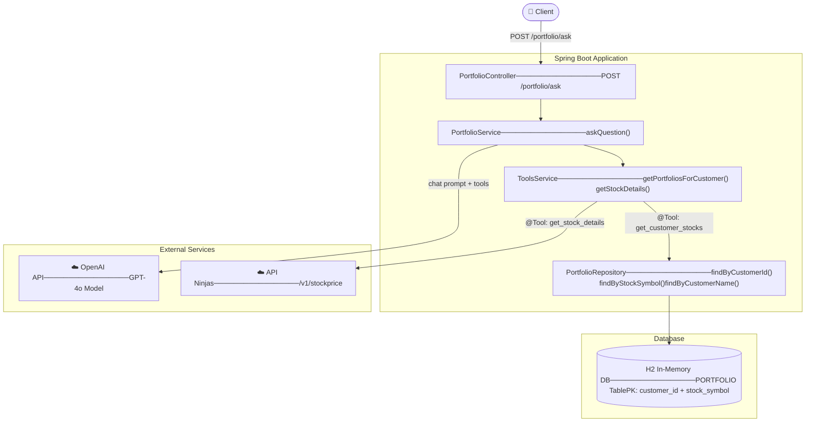
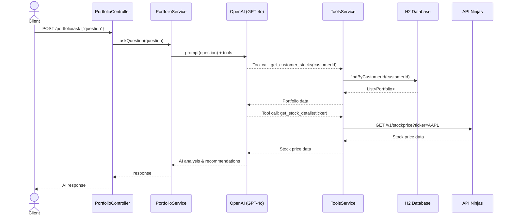
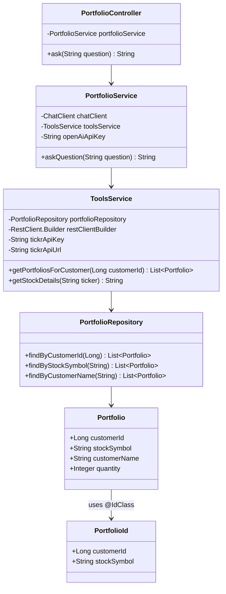
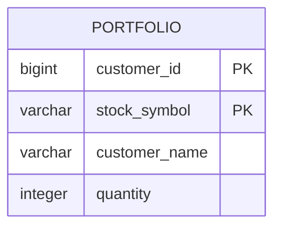
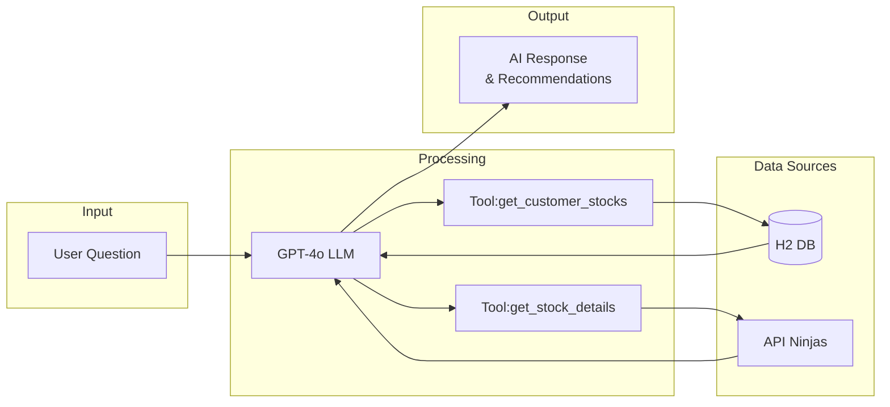

# My Stock Portfolio - Design Diagram

My Stock Portfolio is an AI-powered application that enables customers to interact with their stock portfolio using natural language.
It integrates with OpenAI's GPT-4o model to provide intelligent analysis and recommendations based on the customer's holdings.
The application fetches real-time stock price data from the API Ninjas stock price API and stores portfolio information in an H2 in-memory database.
Built on Spring Boot 3.5.11 with Spring AI, it follows a clean layered architecture with a REST API, service layer, and repository pattern.

## System Architecture

---

## Sequence Diagram

---

## Class Diagram

---

## Entity Relationship Diagram

---

## Data Flow

